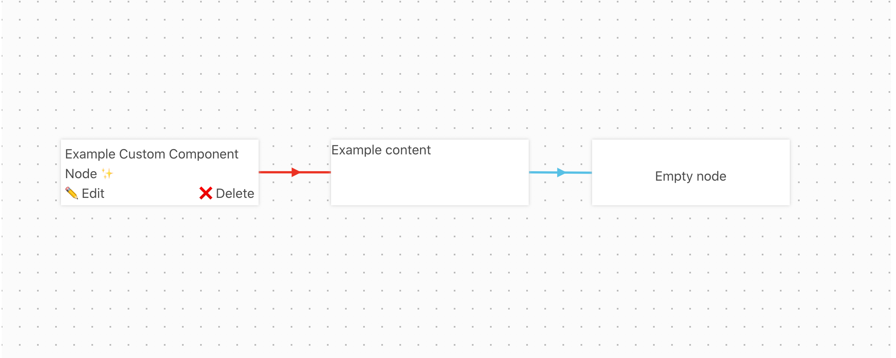
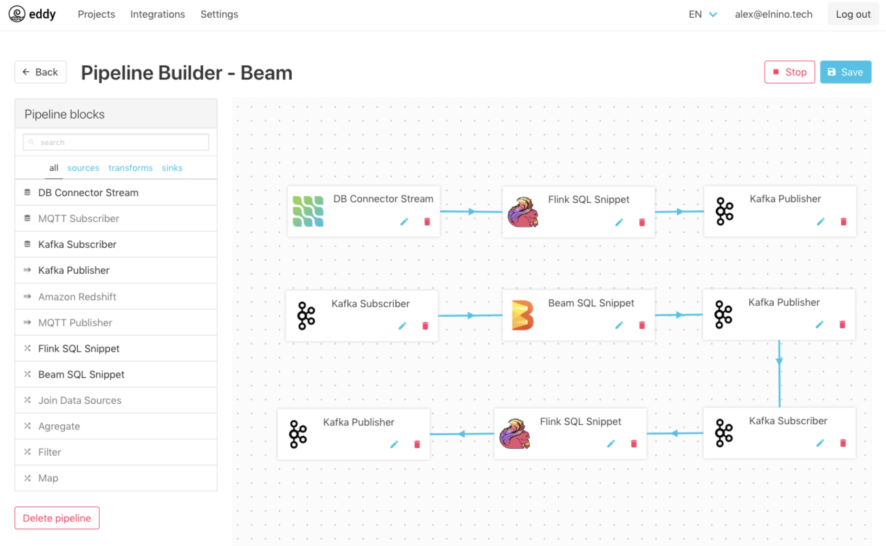

# 🏗Vue DAG Builder

> Data-driven directed acyclic graph (DAG) visual builder for Vue.js

 [](https://github.com/aleximb/vue-dag/actions) [](https://app.netlify.com/sites/vue-dag/deploys)
[ ](https://www.npmjs.com/package/vue-dag)
[](https://vuejs.org/)


## Examples

[vue-dag-example.netlify.app](https://vue-dag-example.netlify.app/)



[eddy-analytics.org](eddy-analytics.org)




## Installation

```bash
npm install --save vue-dag
```
or 
```bash
yarn add vue-dag
```

Import and register the component
```js
import VueDag from 'vue-dag';
```

```js
components: {
    VueDag
}
```

Use it in templates
```html
<vue-dag v-model="graphData"></vue-dag>
```

The component does not include any CSS. You'll need to import it separately:
```js
import 'vue-dag/dist/vue-dag.css';
```

Alternatively, you can import the SCSS version and overrite variables and styles
 ```scss
@import 'vue-dag/src/scss/vue-dag.scss';
```

Full documentation: [https://vue-dag.netlify.com/](https://vue-dag.netlify.com/)


## Project development setup


### Installs dependencies
```
yarn install
```

### Compiles and hot-reloads for development
```
yarn run serve
```

### Lints and fixes files
```
yarn run lint
```

### Runs unit tests
```
yarn run test:unit
```

### Builds as library
```
yarn run build:library
```
